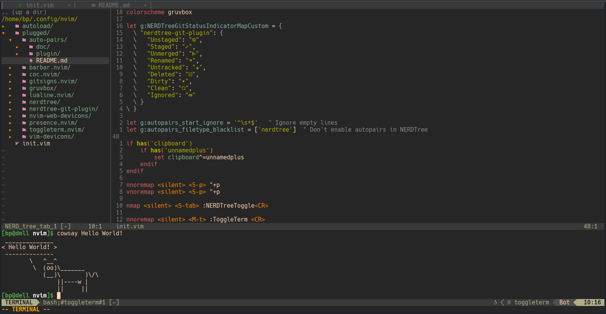

# BPPL's init.vim
### This configuration uses [vim-plug](https://github.com/junegunn/vim-plug) for plugin management.
&nbsp;
## Used plugins:
1. [lewis6991/gitsigns.nvim](https://github.com/lewis6991/gitsigns.nvim)
2. [nvim-lualine/lualine.nvim](https://github.com/nvim-lualine/lualine.nvim)
3. [nvim-tree/nvim-web-devicons](https://github.com/nvim-tree/nvim-web-devicons)
4. [neoclide/coc.nvim](https://github.com/neoclide/coc.nvim)
5. [akinsho/toggleterm.nvim](https://github.com/akinsho/toggleterm.nvim)
6. [scrooloose/nerdtree](https://github.com/scrooloose/nerdtree)
7. [jiangmiao/auto-pairs](https://github.com/jiangmiao/auto-pairs)
8. [ryanoasis/vim-devicons](https://github.com/ryanoasis/vim-devicons)
9. [morhetz/gruvbox](https://github.com/morhetz/gruvbox)
10. [Xuyuanp/nerdtree-git-plugin](https://github.com/Xuyuanp/nerdtree-git-plugin)
11. [andweeb/presence.nvim](https://github.com/andweeb/presence.nvim)
12. [romgrk/barbar.nvim](https://github.com/romgrk/barbar.nvim)

## Custom keymaps
1. Shift + p (`<S-p>`) - Pasting from system clipboard (`"+p`)
2. Shift + Tab (`<S-tab>`) - Toggle Nerd Tree (`:NERDTreeToggle`)
3. Alt + t (`<M-t>`) - Toggle terminal (`:ToggleTerm`)
4. Shift + t (`<S-t>`) - Open a new tab (`:tabnew`)
5. Shift + Left/h/j (`<S-Left>`/`<S-h>`/`<S-j>`) - Go to previous tab (`:BufferPrevious`)
6. Shift + Right/k/l (`<S-Right>`/`<S-k>`/`<S-l>`) - Go to next tab (`:BufferNext`)
&nbsp;

