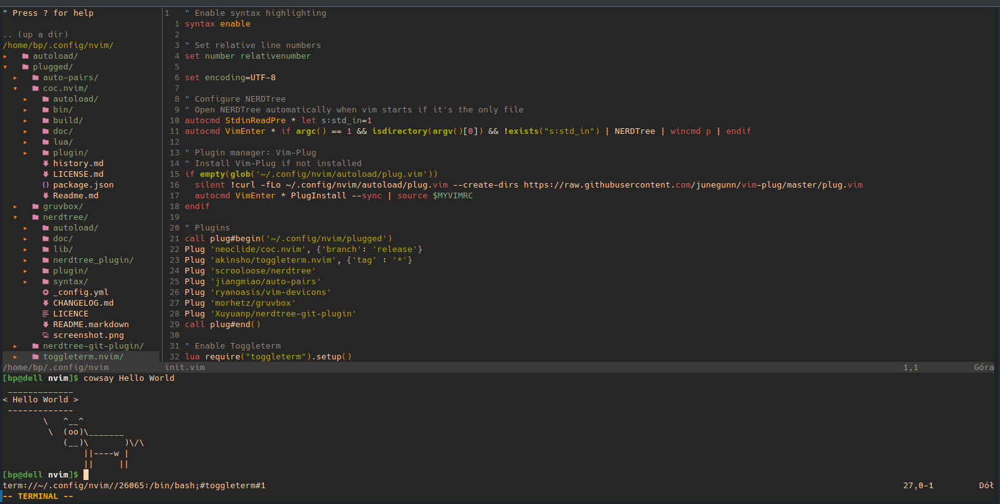

# BPPL's init.vim
### This configuration uses [vim-plug](https://github.com/junegunn/vim-plug) for plugin management.
&nbsp;
## Used plugins:
1. [neoclide/coc.nvim](https://github.com/neoclide/coc.nvim) - Code completion
2. [scrooloose/nerdtree](https://github.com/preservim/nerdtree) - Nerd Tree file explorer
3. [Xuyuanp/nerdtree-git-plugin](https://github.com/Xuyuanp/nerdtree-git-plugin) - Nerd Tree git indicators
4. [ryanoasis/vim-devicons](https://github.com/ryanoasis/vim-devicons) - Nerd Tree icons
5. [jiangmiao/auto-pairs](https://github.com/jiangmiao/auto-pairs) - Auto pairs
6. [morhetz/gruvbox](https://github.com/morhetz/gruvbox) - Color scheme
7. [akinsho.toggleterm.nvim](https://github.com/akinsho/toggleterm.nvim)

## Custom keymaps
1. Shift+p (`<S-p>`) - Pasting from system clipboard (`"+p`)
2. Shift+Tab (`<S-tab>`) - Toggle Nerd Tree (`:NERDTreeToggle`)
3. Alt+t (`<M-t>`) - Toggle terminal (`:ToggleTerm`)
&nbsp;

